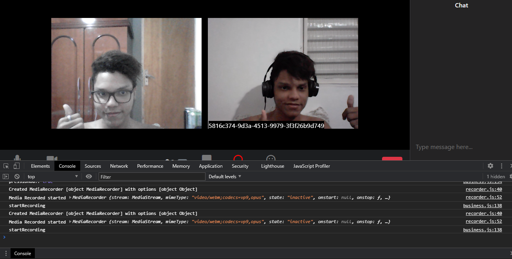

 #   Clone - :blue_heart:

<p align="center">
  
  
</p>

<p align="center">
  <a href="#bookmark-sobre">Sobre</a>&nbsp;&nbsp;&nbsp;|&nbsp;&nbsp;
  <a href="#video_game-como-executar-a-aplicação">Como executar</a>&nbsp;&nbsp;
|&nbsp;&nbsp;&nbsp;
  <a href="#books-dependências">Dependências</a>&nbsp;&nbsp;&nbsp;|&nbsp;&nbsp;&nbsp;
  <a href="#memo-licença">Licença</a>&nbsp;&nbsp;&nbsp;|&nbsp;&nbsp;&nbsp;
  <a href="#computer-desenvolvimento">Desenvolvimento</a>
</p>

## :bookmark: Sobre
>:pushpin: 
Nessa aplicação recriamos uma experiência de vídeo conferência utilizada por umas da melhores empresas nesse aspecto, a **zoom.us**, e também utilizamos API nativas do browser e das melhores práticas com padrões de projetos e o pattern utilizado para o exito da aplicação foi o Builder.

**Acesse o projeto**:  [Zoom Clone](https://zoom-clone-hn.herokuapp.com/pages/home/)

## Home Page


## Room


## Room in Call



## :video_game: Como executar a aplicação

1. Crie uma pasta e execute chamada zoom-clone e entre, depois use
`git clone git@github.com:HallanCosta/zoom-clone.git .`
ou
`git clone https://github.com/HallanCosta/zoom-clone.git .`
 para fazer um clone da aplicação.

2. Instalação de dependências e execução front-end.
	```sh
	# Localizando front-end.
	$ cd public
	
	# Instalação.
	$ yarn install # ou npm install
	
	# Execução.
	$ yarn start # ou npm start
	```
3. Instalação de dependências e execução do server.

	```sh
	# Localizando o server socket.io.
	$ cd server
	
	# Instalação.
	$ yarn install # ou npm install
	
	# Execução.
	$ yarn start # ou npm start
	```
4. Instalação de dependências e execução do server PeerJS.
	```sh
	# Localizando o peer-server.
	$ cd peer-server
	
	# Instalação.
	$ yarn install # ou npm install
	
	# Execução.
	$ yarn dev# ou npm run dev
	```

**Pronto!!** agora a aplicação está rodando em ambiente de desenvolvimento.


## :books: Dependências
### 1. Dependências
 - [x] peer
 - [x] http-server
 - [x] socket.io

### 2. Dependências de desenvolvimento

 - [x]  nodemon

## :memo: Licença
Esse projeto está sob a licença MIT. Veja o arquivo [LICENSE](https://github.com/HallanCosta/zoom-clone/blob/main/LICENSE) para mais detalhes.

## :computer: Desenvolvimento
| Aluno| Professor|
|--|--|
| [<br><sub>@HallanCosta</sub>](https://github.com/HallanCosta) | [<br><sub>@ErickWendel</sub>](https://github.com/ErickWendel) |